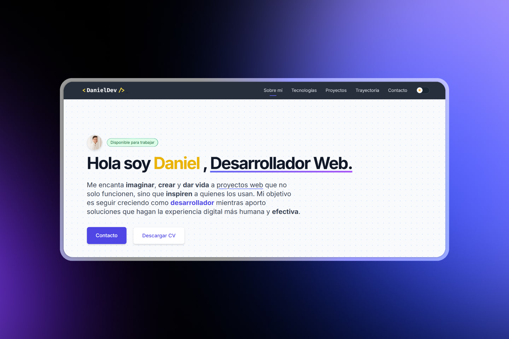

# 🚀 Portfolio Web Personal - Daniel Gil

[](https://astro.build/)
[](https://tailwindcss.com/)
[](https://www.typescriptlang.org/)



## 🌟 Descripción

Portfolio web personal desarrollado con un diseño minimalista, elegante y totalmente responsive, donde muestro mis proyectos, experiencia y habilidades de forma clara y profesional. Ideal para desarrolladores que desean tener presencia online con un sitio web moderno.

## 💻 Tecnologías Utilizadas

Este proyecto fue desarrollado utilizando un stack moderno de tecnologías:

- **[Astro](https://astro.build/)**: Framework web que ofrece rendimiento excepcional con "Zero JS by default"
- **[Tailwind CSS](https://tailwindcss.com/)**: Framework CSS utility-first para diseño rápido y responsivo
- **[TypeScript](https://www.typescriptlang.org/)**: Superconjunto tipado de JavaScript
- **[Formspree](https://formspree.io/)**: Servicio para gestión de formularios sin backend
- **[Google reCAPTCHA](https://www.google.com/recaptcha/about/)**: Protección contra spam en el formulario de contacto

## 🌈 Características

- ✅ **Diseño Responsive**: Adaptación perfecta a cualquier dispositivo
- ✅ **Modo Oscuro/Claro**: Cambia entre temas según preferencias del usuario
- ✅ **Secciones Completas**: Sobre mí, proyectos, experiencia, tecnologías y contacto
- ✅ **Formulario de Contacto**: Integración con Formspree y Google reCAPTCHA
- ✅ **Animaciones Suaves**: Mejora de la experiencia del usuario
- ✅ **SEO Optimizado**: Meta etiquetas y estructura semántica
- ✅ **Optimización de Rendimiento**: Carga rápida y experiencia fluida

## 🚀 Cómo Usar Este Proyecto

### Requisitos Previos

- Node.js (versión 18 o superior)
- npm o yarn

### Instalación

1. Clona este repositorio:
   ```bash
   git clone https://github.com/danielgil-dev/danielgil-dev-portfolio.git
   cd danielgil-dev-portfolio
   ```

2. Instala las dependencias:
   ```bash
   npm install
   # o
   yarn install
   ```

3. Crea un archivo `.env` en la raíz del proyecto basado en el archivo `.env.example`:
   ```bash
   cp .env.example .env
   ```
   Y configura tus propias claves de API para Formspree y reCAPTCHA.

4. Inicia el servidor de desarrollo:
   ```bash
   npm run dev
   # o
   yarn dev
   ```

5. Abre tu navegador en `http://localhost:4321`

### Personalización

1. Modifica los datos personales en `src/data/projects.ts`
2. Actualiza las imágenes en `src/assets/images/`
3. Configura las variables de entorno en el archivo `.env` siguiendo el ejemplo de `.env.example`
4. Personaliza los componentes según tus necesidades
5. ¡Añade tus propios proyectos y experiencia!

## 📦 Estructura del Proyecto

```
danielgil-dev-portfolio/
├── public/              # Archivos estáticos (PDFs, imágenes, etc.)
├── src/
│   ├── assets/          # Iconos, imágenes y componentes de UI reutilizables
│   ├── components/      # Componentes de la UI
│   ├── data/            # Datos estructurados (proyectos, experiencia)
│   ├── layouts/         # Layouts de páginas
│   ├── pages/           # Páginas del sitio
│   └── styles/          # Estilos globales
├── astro.config.mjs     # Configuración de Astro
└── tailwind.config.mjs  # Configuración de Tailwind CSS
```

## 🔧 Scripts Disponibles

- `npm run dev`: Inicia el servidor de desarrollo
- `npm run build`: Construye el proyecto para producción
- `npm run preview`: Previsualiza la build de producción localmente

## 📄 Licencia

Este proyecto está bajo la Licencia MIT - consulta el archivo LICENSE para más detalles.

## 🤝 Contribuciones

¡Las contribuciones son bienvenidas! Si tienes alguna idea para mejorar este portfolio, no dudes en abrir un issue o enviar un pull request.

## 🌎 Demo

Visita la versión desplegada de este portfolio: **[danielgil.dev](https://danielgil.netlify.app/)**

---

⭐️ Si te gustó este proyecto, ¡no olvides darle una estrella en GitHub! ⭐️
